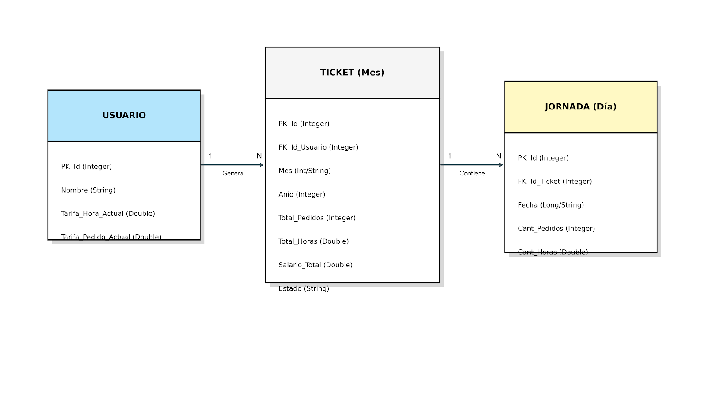

# 🛵 SCalc - Salary Calculator for Delivery Drivers


**SCalc** es una aplicación móvil nativa diseñada para solucionar la problemática de gestión financiera de los repartidores de comida a domicilio ("Riders"). Permite un control exhaustivo de ingresos, horas trabajadas y pedidos realizados, automatizando cálculos que tradicionalmente se realizan de forma manual e ineficiente.

Este proyecto forma parte del Trabajo de Fin de Grado (TFG) para el ciclo de **Desarrollo de Aplicaciones Multiplataforma (2º DAM)**.

---

## 📋 Tabla de Contenidos
- [Problema y Solución](#-problema-y-solución)
- [Características Principales](#-características-principales)
- [Arquitectura de Datos](#-arquitectura-de-datos)
- [Tecnologías Utilizadas](#-tecnologías-utilizadas)
- [Instalación y Uso](#-instalación-y-uso)
- [Autor](#-autor)

---

## 🧐 Problema y Solución

### El Problema
Los repartidores a menudo cobran bajo modelos variables (pago por hora + pago por pedido) y carecen de herramientas específicas para registrar su actividad. El uso de hojas de cálculo genéricas o notas manuales resulta propenso a errores y dificulta conocer el salario real o comparar la productividad entre meses.

### La Solución: SCalc
Una aplicación Android que centraliza la gestión laboral del *rider*. El usuario introduce sus tarifas personalizadas y registra diariamente su actividad. La app procesa estos datos para ofrecer:
* Cálculo automático del salario mensual.
* Estadísticas de rendimiento (pedidos/hora).
* Histórico de "Tickets" mensuales cerrados.

---

## 🚀 Características Principales

* **Gestión de Tarifas Personalizable:** El usuario define sus bonificaciones (Precio por Hora y Precio por Pedido) en su perfil.
* **Registro de Jornadas:** Interfaz rápida para ingresar horas y pedidos al finalizar el turno.
* **Cálculo en Tiempo Real:** Algoritmo interno que combina las tarifas vigentes con la actividad diaria.
* **Historial Mensual (Tickets):** Organización automática de jornadas en "Tickets" mensuales que congelan el salario calculado para mantener la integridad histórica.
* **Funcionamiento Offline:** Persistencia de datos local mediante SQLite, garantizando privacidad y acceso sin conexión a internet.
* **Análisis de Rendimiento:** Visualización de la media de pedidos por hora para evaluar la productividad.

---

## 🗂 Arquitectura de Datos

El núcleo de la aplicación se basa en una base de datos relacional robusta que garantiza la integridad de los datos históricos frente a cambios en las tarifas del usuario.

### Diagrama Entidad-Relación (ER)
> *El sistema se estructura en tres entidades principales: Usuario (Configuración), Ticket (Contenedor mensual) y Jornada (Detalle diario).*



### Estructura Lógica
1.  **USUARIO:** Almacena la configuración global y las tarifas actuales.
2.  **TICKET:** Representa el mes trabajado. Almacena los totales calculados (`Salario_Total`, `Total_Pedidos`) actuando como una "factura" cerrada.
3.  **JORNADA:** Registra la actividad unitaria de cada día, vinculada a un ticket específico.

---

## 🛠 Tecnologías Utilizadas

### Entorno de Desarrollo
* **IDE:** Android Studio
* **Lenguaje:** Java (JDK 21)
* **Control de Versiones:** Git & GitHub

### Backend & Persistencia
* **Base de Datos Local:** SQLite (mediante `SQLiteOpenHelper`)
* **Diseño de Modelo:** POJOs personalizados y patrón DAO.

### Diseño UI/UX
* **Herramientas:** Figma / Canva
* **Componentes:** XML Layouts, Material Design Components.

---

## 📲 Instalación y Uso

Para probar este proyecto en local:

1.  **Clonar el repositorio:**
    ```bash
    git clone [https://github.com/SLOPTRI/SCalc.git](https://github.com/SLOPTRI/SCalc.git)
    ```
2.  **Abrir en Android Studio:**
    * Selecciona `File` > `Open` y busca la carpeta clonada.
    * Espera a que Gradle sincronice las dependencias.
3.  **Ejecutar:**
    * Conecta un dispositivo físico (Depuración USB activa) o usa un Emulador (Recomendado: Pixel 7 API 33+).
    * Presiona el botón `Run` (▶).

---

## 👤 Autor

**Salvador López Trigueros**
* **Estudios:** Desarrollo de Aplicaciones Multiplataforma (2º DAM)
* **Contacto:** [www.linkedin.com/in/salvador-lópez-trigueros-dev]

---
*Este proyecto es de carácter académico y está sujeto a derechos de autor del creador.*