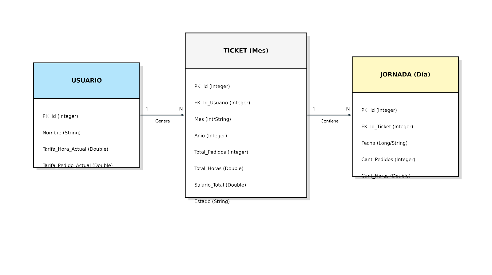

# 🛵 SCalc - Salary & Logistics Calculator


**SCalc** is a native Android application engineered to address the financial management challenges faced by delivery riders ("Riders"). It provides a comprehensive tracking system for earnings, hours worked, and delivery metrics, automating calculations that are typically prone to manual errors and inefficiencies.

This project was developed as my **Final Degree Project** for the Multiplatform Application Development degree.

---

## 📋 Table of Contents
- [The Problem & Solution](#-the-problem--solution)
- [Key Features](#-key-features)
- [Data Architecture](#-data-architecture)
- [Tech Stack](#-tech-stack)
- [Installation](#-installation)
- [Author](#-author)

---

## 🧐 The Problem & Solution

### The Challenge
Delivery drivers often operate under variable payment models (pay-per-hour + pay-per-order) and lack specialized tools to track their activity. Relying on generic spreadsheets or manual notes often leads to calculation errors and hinders the ability to compare productivity or net income over time.

### The Solution: SCalc
A native Android application that centralizes the rider's professional activity. By defining custom pay rates, users can input their daily activity, and SCalc handles the logic to provide:
* **Automated monthly salary calculation.**
* **Performance metrics (orders/hour).**
* **Historical "Ticket" management** (monthly salary closures).

---

## 🚀 Key Features

* **Customizable Pay Rates:** Define your specific bonus structure (Hourly Rate & Per-Order Rate) in your profile.
* **Daily Activity Logging:** Streamlined interface for rapid input of hours and orders at the end of a shift.
* **Real-Time Calculation:** An internal logic engine that combines active rates with daily activity data.
* **Monthly "Tickets":** Automatic grouping of shifts into monthly cycles, freezing calculated earnings to maintain historical data integrity.
* **Offline-First:** Full data persistence using **SQLite**, ensuring privacy and accessibility without an internet connection.
* **Performance Analysis:** Visual tracking of orders-per-hour to evaluate and optimize productivity.

---

## 🗂 Data Architecture

The core of the app relies on a robust relational database designed to ensure data integrity even when user rates change over time.

### Entity-Relationship Structure
> *The system is built around three main entities: User (Configuration), Ticket (Monthly Container), and Shift (Daily Activity).*



### Logical Structure
1. **USER:** Stores global configuration and active pay rates.
2. **TICKET:** Represents a working month. Stores frozen calculations (`Total_Salary`, `Total_Orders`), acting as a sealed "invoice."
3. **SHIFT:** Records unit activity for each day, linked to a specific Ticket.

---

## 🛠 Tech Stack

### Development Environment
* **IDE:** Android Studio
* **Language:** Java (JDK 21)
* **Version Control:** Git & GitHub

### Backend & Persistence
* **Local Database:** SQLite (via `SQLiteOpenHelper`)
* **Data Pattern:** Custom POJOs and DAO pattern for abstraction.

### UI/UX
* **Design Tools:** Figma
* **Components:** XML Layouts, Material Design Components.

---

## 📦 Installation

To run this project locally:

1. **Clone the repository:**
   ```bash
   git clone https://github.com/SLOPTRI/SCalc.git
   ```
2. **Open in Android Studio:**
   - Select `File` > `Open` and navigate to the cloned folder.
   - Wait for Gradle to sync all dependencies.
3. **Run:**
   - Connect a physical device (with USB Debugging enabled) or use an Emulator (Pixel 7 API 33+ recommended).
   - Click the **Run** (▶) button.

---

## 🚀 Roadmap & Future Evolution
This project is currently the bridge between my degree and my upcoming evolution. Next steps include:
* **Flutter Porting:** Migrating the core logic to Flutter/Dart for cross-platform support (iOS/Web).
  
---

## 👤 Author

**Salvador López Trigueros**
* **Field:** Multiplatform Software Developer
* **[LinkedIn](https://www.linkedin.com/in/salvador-l%C3%B3pez-trigueros-7439781b5/)**

---
*This is an academic project subject to copyright.*
